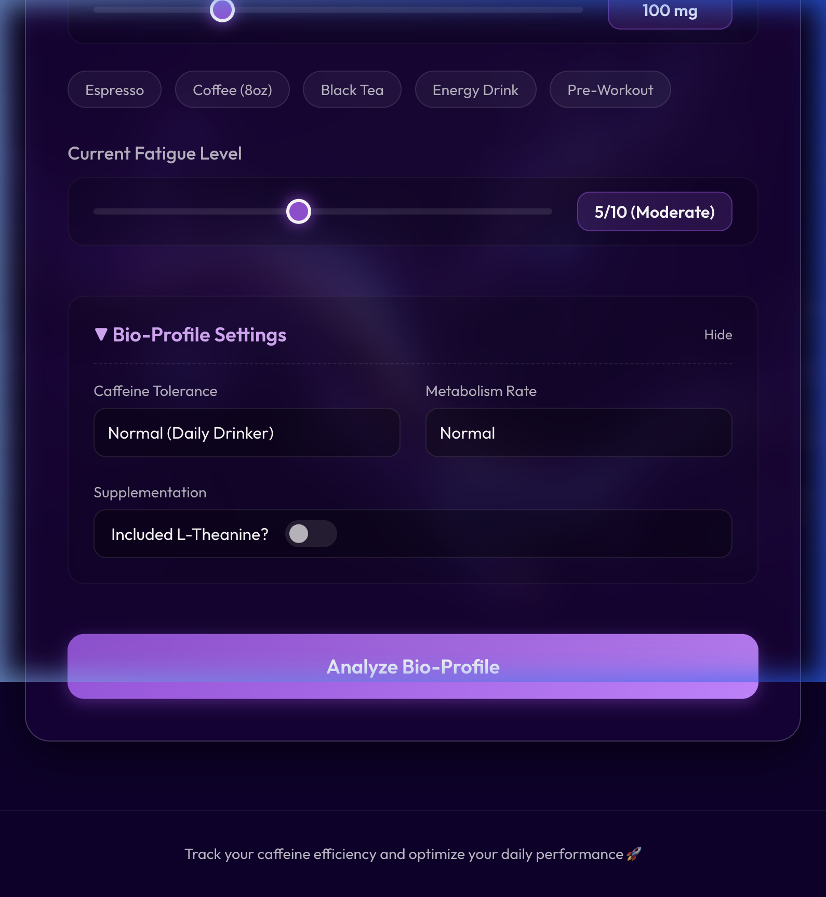
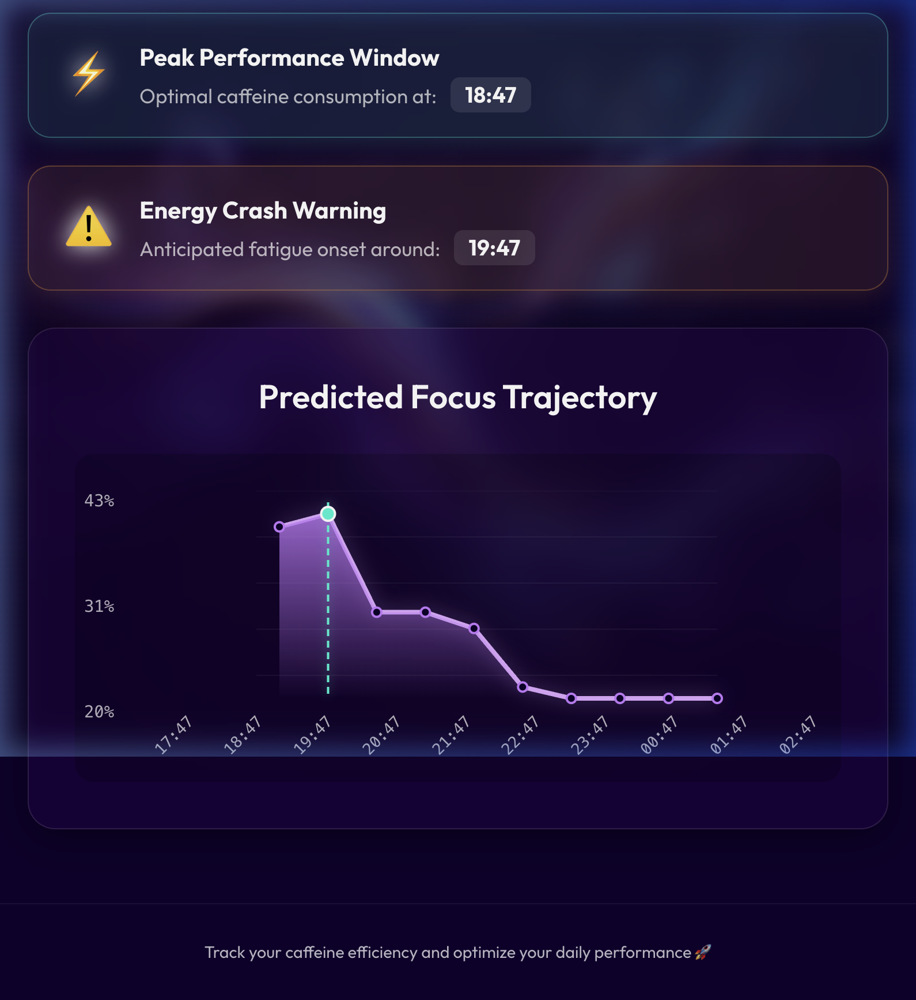

# ☕ Caffeine Efficiency Tracker

A smart, interactive, full-stack web application that helps users **optimize caffeine consumption** by predicting their **focus levels** based on **sleep patterns**, **fatigue levels**, and **personalized bio-profile metrics** (tolerance, metabolism rate, and supplementation).

---

## 🚀 Live Demo

> **[View Live App](https://caffeine-efficiency-tracker.vercel.app/)**

---

## 🧠 What It Does

Using a trained Machine Learning model (RandomForestRegressor) integrated with dynamic pharmacokinetic rules, this tracker simulates and predicts:
- 🔥 Your **focus level trajectory over the next 10 hours**
- ⚡ **Best time to consume caffeine** for peak productivity
- ⚠️ A **crash alert** if your focus is expected to dip significantly
- 📊 A dynamic graph showing your **hourly focus variation**
- 💡 **Actionable real-time advice** tailored precisely to your physiological inputs

---

## 🛠️ Tech Stack

| Layer        | Technologies                                      |
|--------------|---------------------------------------------------|
| **Frontend** | React.js, CSS (Glassmorphism UI)                  |
| **Backend**  | Flask, Python                                     |
| **ML & Data**| scikit-learn, Pandas, NumPy                       |
| **Extras**   | Vercel Deployment, REST APIs, Responsive UI       |

---

## 📸 Screenshots

### Setup & Bio-Profile Config


### Results & Focus Prediction


---

## 📦 Features

- 🎯 **Advanced Bio-Profile Settings**: Fine-tune predictions based on your caffeine tolerance (low, normal, high), metabolism rate (slow, normal, fast), and L-Theanine supplementation.
- ☕ **Predefined Beverage Presets**: Quickly select common drinks (Espresso, Black Tea, Energy Drink, etc.) to set caffeine intake.
- ⚡ Real-time **optimal caffeine time** predictor
- 📉 **Crash alert** warning when energy is expected to dip
- 📈 **Focus graph** visualization for the next 10 hours with smooth trajectories.
- 📱 **Fully responsive, glassmorphism UI** for desktop and mobile devices.

---

## 📘 Prediction Terms Explained

### ⚡ Optimal Caffeine Time
- The **time when your predicted focus level is the highest** after caffeine intake.
- This is the **best time to consume coffee** to maximize productivity.
- Dynamically affected by tolerance (which changes peak height).

### 🔺 Peak Focus
- The **maximum focus level** predicted in the 10-hour window.
- Used to calculate both the optimal time and crash risk.

### ⚠️ Crash Alert Time
- If your predicted focus **drops significantly** after the peak, the app flags a **crash time**.
- L-Theanine supplementation smooths out the curve, potentially delaying or mitigating severe crashes.

### 📊 Hourly Focus Simulation
- The **mean focus level** across the 10-hour period.
- Factors in metabolism rate (which affects the decay rate of caffeine in your system).

---

## 🛠️ How It Works

1. User inputs:
   - Hours of sleep last night
   - Current fatigue level
   - Amount of caffeine intake (mg) or Preset
   - Bio-Profile Rules (Tolerance, Metabolism, L-Theanine)

2. Backend (`/predict`) uses the trained ML model combined with pharmacokinetic multipliers:
   - Predicts a **base focus level**
   - Simulates hourly variations over 10 hours applying decay and peak multipliers
   - Computes **optimal time**, **potential crash**, and generates customized **actionable advice**

3. Frontend displays:
   - Interactive focus graph
   - Optimal & crash alert metrics
   - Real-time advice and insights

---

## 🧾 Installation & Local Setup

```bash
# Clone repo
git clone https://github.com/CodeNameSS24/caffeine_efficiency_tracker.git
cd caffeine_efficiency_tracker

# Install Python backend dependencies
cd backend
pip install -r requirements.txt

# Train & save model (first time only)
python train_model.py

# Start Flask API
python caffeine_efficiency_api.py

# Open new terminal for frontend
cd ../frontend
npm install
npm start
```
